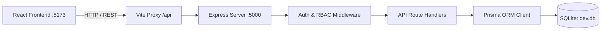

# Real Estate CRM

A modern, full-stack Real Estate Customer Relationship Management (CRM) platform engineered for real estate sales teams, brokers, and administrators to track leads, manage property inventory, schedule site visits, and coordinate unit reservations.

---

## Table of Contents

- [Overview](#overview)
- [Features](#features)
- [User Roles](#user-roles)
- [Lead Management](#lead-management)
- [Property Management](#property-management)
- [Booking Management](#booking-management)
- [Dashboard](#dashboard)
- [Authentication & Authorization](#authentication--authorization)
- [Tech Stack](#tech-stack)
- [Architecture](#architecture)
- [API Modules](#api-modules)
- [Database](#database)
- [Business Rules](#business-rules)
- [UI/UX](#uiux)
- [Key Technical Decisions](#key-technical-decisions)
- [Local Setup](#local-setup)
- [Environment Variables](#environment-variables)
- [Test Credentials](#test-credentials)
- [Testing](#testing)
- [Project Structure](#project-structure)
- [Deployment](#deployment)
- [Assignment Notes](#assignment-notes)
- [Author](#author)

---

## Overview

The **Real Estate CRM** is an end-to-end sales management platform built to address real-world real estate brokerage operations. It provides agency directors and sales agents with centralized visibility into incoming prospective buyers, property inventory across multi-building developments, scheduled client site visits, and unit reservations.

The application addresses common brokerage challenges:
- Eliminates manual spreadsheet tracking by maintaining structured lead stages and recorded follow-up schedules.
- Manages multi-tier property hierarchies (Projects &rarr; Buildings &rarr; Units).
- Prevents expensive scheduling mistakes through database and UI-level **duplicate booking prevention** for reserved units.
- Enforces strict Role-Based Access Control (RBAC) to protect sensitive client records and deletion operations.

---

## Features

- **Authentication & Role-Based Access Control**: Secure JWT-based authentication with distinct capabilities for Admin and Sales Employee roles.
- **Interactive KPI Dashboard**: Aggregate sales metrics (Active Leads, Listed Properties, Site Visit Bookings, Pipeline Volume) with one-click drill-down navigation and recent activity feeds.
- **Lead Pipeline Management**: Full lifecycle tracking across 7 lead stages, lead priority statuses, follow-up dates, budget tracking, and sales agent assignment.
- **Property & Inventory Catalog**: Multi-level hierarchy supporting residential, commercial, and land units with pricing, specs (beds/baths/sqft), and listing statuses.
- **Booking & Reservation Engine**: Booking coordination for site visits, unit reservations, contract signings, and virtual walkthroughs.
- **Duplicate Booking Protection**: Active double-booking guard that prevents simultaneous confirmed or pending reservations on the same property unit.
- **Search & Multi-Filter Capabilities**: Search across names, emails, phones, property codes, and booking codes, combined with status and agent filters.
- **Batch / Bulk Actions**: Multi-row selection for bulk deletions (Admin only).
- **Comprehensive Feedback States**: Dedicated skeleton loading states, empty state screens with quick-action CTAs, and error boundaries with retry mechanisms.

---

## User Roles

The platform implements two distinct roles with explicit permission boundaries:

| Capability | Admin | Sales Employee |
| :--- | :---: | :---: |
| View Dashboard KPIs & Recent Activity | Yes | Yes |
| View Leads, Properties & Bookings | Yes | Yes |
| Create New Leads | Yes | Yes |
| Update Lead Details & Stages | Yes | Yes |
| Create Property Listings | Yes | Yes |
| Update Property Details & Status | Yes | Yes |
| Schedule & Update Bookings | Yes | Yes |
| Single & Bulk Delete Leads | Yes | No (Forbidden - 403) |
| Single & Bulk Delete Properties / Units | Yes | No (Forbidden - 403) |
| Single & Bulk Delete Bookings | Yes | No (Forbidden - 403) |
| Project & Building Master Deletion | Yes | No (Forbidden - 403) |

### Role Differences
- **Admin**: Has overarching supervisory rights (`manage_all`, `delete_leads`, `delete_properties`, `delete_bookings`). All destructive `DELETE` and bulk delete endpoints require this role via backend middleware.
- **Sales Employee**: Focused on customer relationships and deal closing. Sales Employees can view leads, properties, and bookings, create new entries, and update existing records across the sales pipeline. Destructive deletion operations (single and bulk delete) are restricted to Admins and blocked by backend route guards (`requireRole('Admin')`).

*Note: For evaluation purposes, the UI includes both quick-fill buttons on the login screen and a live role-switcher toggle in the top navigation bar to test role-based behavior seamlessly.*

---

## Lead Management

The Lead Management module tracks potential buyers from initial inquiry to final deal closing.

### Implemented Lead Stages
1. **New**: Fresh inbound lead captured via website forms or portals.
2. **Contacted**: Initial call or correspondence initiated by the assigned agent.
3. **Site Visit**: Physical or virtual walkthrough organized.
4. **Interested**: Buyer confirmed interest and is reviewing pricing/specs.
5. **Negotiation**: Active discussions regarding terms, pricing, or seller concessions.
6. **Booked**: Unit reserved with deposit or contract drafted.
7. **Lost**: Lead disqualified or opted out.

### Key Lead Functionality
- **Lead Profiles**: Stores contact details (name, email, phone), property of interest, budget range, lead source, assigned agent, follow-up dates, and activity notes.
- **Priority Indicators**: Categorized by status: `Hot Lead`, `Active`, `Follow-up Needed`, and `Cold`.
- **Filtering & Search**: Filter leads by stage tabs with dynamic counters, agent dropdown, status dropdown, and text search across names, emails, phones, and property interests.
- **Modals**: Full view modal with customer summary, creation modal with client-side form validation, and edit modal.

---

## Property Management

The Property Management module provides a structured catalog of available real estate inventory.

### Structure & Hierarchy
- **Projects**: Master development projects (e.g., *Sovereign Heights*, *Azure Bay Community*) containing project type, city, state, and address.
- **Buildings**: Specific towers or phases within a project with floor counts and unit totals.
- **Units / Properties**: Individual sellable units with unit code (e.g., `PR-201`), unit type, location, price, bedroom count, bathroom count, square footage, listed date, and assigned listing agent.

### Property Types & Statuses
- **Types**: `Apartment`, `Villa`, `Penthouse`, `Townhouse`, `Commercial`, `Plot / Land`.
- **Statuses**:
  - `Active`: Available on the open market.
  - `Pending`: Under reservation, escrow, or contract negotiations.
  - `Sold`: Deal concluded.
  - `Off Market`: Delisted or temporarily withheld.

### Key Property Features
- Instant search across listing titles, locations, unit codes, and property types.
- Type and status filter pills with count badges.
- Property detail modal displaying architectural specs, pricing, and assigned agent.
- Add and Edit property modals with numeric input formatting and validation.

---

## Booking Management

The Booking Management module handles customer site visits, reservations, and contract meetings.

### Implemented Booking Attributes
- **Booking Types**: `Site Visit`, `Unit Reservation`, `Contract Signing`, `Virtual Walkthrough`.
- **Statuses**: `Confirmed`, `Pending`, `Completed`, `Cancelled`.
- **Time Slots**: Predefined scheduling slots (`09:00 AM`, `10:30 AM`, `12:00 PM`, `02:00 PM`, `03:30 PM`, `05:00 PM`).
- **Financial Tracking**: Optional token/earnest money deposit tracking (e.g., `$50,000`).

### Duplicate Booking Prevention
The system enforces strict **duplicate booking protection** across both client and server layers:
1. **Database / API Guard**:
   - When a booking is submitted with status `Confirmed` or `Pending`, the server queries for any existing active booking for the same unit.
   - If an active booking already exists, the server rejects the request with an **HTTP 409 Conflict** error:
     ```json
     {
       "success": false,
       "error": "Double-booking prevention: Unit \"...\" is already reserved under active booking #BK-... by ... (Confirmed). Please select an available unit or cancel the prior booking."
     }
     ```
2. **Transactional State Update**:
   - Creating a `Unit Reservation` automatically updates the corresponding unit status to `Pending` using a database transaction (`prisma.$transaction`).
3. **Client-Side Pre-Validation**:
   - The booking form modal detects occupied units, displays an alert banner showing the existing reservation code and client name, and blocks submission before making an API call.

---

## Dashboard

The dashboard serves as the central command center for sales operations:

- **Executive KPI Cards**:
  - **Active Leads**: Total count of active inquiries in the pipeline with trend indicators.
  - **Listed Properties**: Total count of units currently active in inventory.
  - **Site Visit Bookings**: Total scheduled customer visits.
  - **Pipeline Volume**: Cumulative dollar valuation of active inventory in the pipeline.
- **Drill-Down Navigation**: Clicking any KPI card immediately navigates to that specific management module.
- **Recent Leads Feed**: Shows latest prospect inquiries, budgets, interest, and status badges.
- **Upcoming Site Visits Feed**: Displays chronological client appointments with times, locations, and assigned agents.
- **Live Sync**: Integrates with `/api/v1/dashboard/stats` and `/api/v1/dashboard/recent-activity`.

---

## Authentication & Authorization

Authentication is implemented using an industry-standard token-based architecture:

- **Password Security**: Passwords are securely hashed and verified using bcryptjs (salt rounds: 10).
- **JWT Tokens**: Upon successful login, the server issues a signed JSON Web Token containing the user's ID and role (`expiresIn: '7d'`).
- **Bearer Authorization**: The frontend includes the token in the `Authorization: Bearer <token>` header on all subsequent requests via a centralized API client (`apiClient.js`).
- **RBAC Middleware**:
  - `authenticateToken`: Validates token signature, verifies user existence and active status in the database, and injects `req.user`.
  - `requireRole('Admin')`: Reusable route guard that evaluates `req.user.role` and responds with `403 Forbidden` if unauthorized.
- **Session Handling**: 401 Unauthorized responses trigger automatic clearing of invalid tokens from browser storage.

---

## Tech Stack

| Layer / Role | Technology | Purpose |
| :--- | :--- | :--- |
| **Frontend** | React (v19) | Modern component-based user interface |
| **Backend** | Node.js + Express.js (v5) | Modular RESTful API server |
| **Database** | SQLite (`dev.db`) | Relational database storage |
| **ORM** | Prisma ORM (v5) | Schema modeling, migrations, and queries |
| **Authentication** | JWT (`jsonwebtoken`) + `bcryptjs` | Token authentication & secure password hashing |
| **Styling** | Tailwind CSS (v4) | Responsive CRM styling and design system |
| **Icons** | Lucide React | Modern iconography |
| **Build Tool** | Vite (v8) | Fast frontend bundler and HMR dev server |
| **Linter** | Oxlint | Fast JavaScript / React static analysis |

---

## Architecture

The application follows a clean client-server architecture with separation between presentation, routing, business logic, and persistence.

```
┌──────────────────────────────────────────────┐
│        Frontend (React 19 + Tailwind)        │
│    Pages: Dashboard, Leads, Properties, ...  │
│    Context: AuthContext, useAuth             │
│    Services: apiClient (Fetch + Bearer JWT)  │
└──────────────────────┬───────────────────────┘
                       │ HTTP REST (Vite Proxy: /api -> :5000)
                       ▼
┌──────────────────────────────────────────────┐
│       Backend API Server (Express.js 5)      │
│  - Middleware: CORS, express.json, Auth/RBAC │
│  - Routes: /auth, /leads, /properties,       │
│            /units, /bookings, /dashboard     │
└──────────────────────┬───────────────────────┘
                       │ Queries / Transactions
                       ▼
┌──────────────────────────────────────────────┐
│              Prisma ORM (v5)                 │
│      Generated Client & Data Validation      │
└──────────────────────┬───────────────────────┘
                       │ SQL
                       ▼
┌──────────────────────────────────────────────┐
│         SQLite Database (prisma/dev.db)      │
│  Tables: User, Project, Building, Unit,      │
│          Lead, Booking                       │
└──────────────────────────────────────────────┘
```



---

## API Modules

All backend endpoints are prefixed under `/api/v1` and return consistent JSON responses (`{ success: true, data: ... }`).

### 1. Authentication (`/api/v1/auth`)
- `POST /login` - Authenticate with email & password; returns user profile and JWT token.
- `GET /me` - Get current authenticated user profile (`authenticateToken`).
- `POST /logout` - Invalidate client session.

### 2. Dashboard (`/api/v1/dashboard`)
- `GET /stats` - Retrieve aggregate statistics (leads, active units, bookings, pipeline volume).
- `GET /recent-activity` - Retrieve the 5 most recent leads and upcoming 4 scheduled visits.

### 3. Leads (`/api/v1/leads`)
- `GET /` - List all leads (supports query parameters: `search`, `stage`, `status`, `agent`).
- `GET /:id` - Get single lead detail with associated booking history.
- `POST /` - Create a new lead record.
- `PUT /:id` - Update an existing lead record.
- `DELETE /:id` - Delete a single lead (**Admin only**).
- `POST /bulk-delete` - Bulk delete multiple leads by ID array (**Admin only**).

### 4. Properties & Units
**Flat CRM Properties API (`/api/v1/properties`):**
- `GET /` - List all properties formatted for CRM inventory table (supports `search`, `type`, `status`, `agent`).
- `GET /:id` - Get property details by unit code or ID.
- `POST /` - Create a new property listing.
- `PUT /:id` - Update property details.
- `DELETE /:id` - Delete a property listing (**Admin only**).
- `POST /bulk-delete` - Bulk delete properties (**Admin only**).

**Hierarchical Relational Units API (`/api/v1/units`):**
- `GET /` - List units with pagination (`page`, `pageSize`) and relational project/building joins.
- `GET /available` - Retrieve units along with their active booking status flags (`isBooked`, `activeBookingCode`).
- `GET /:id` - Get unit details with full booking history.
- `POST /` - Create a unit.
- `PUT /:id` - Update unit attributes.
- `DELETE /:id` - Delete unit (**Admin only**).

### 5. Projects & Buildings
- `GET /api/v1/projects` - List master projects with building and unit counts.
- `GET /api/v1/projects/:id` - Get project with nested buildings and units.
- `POST /api/v1/projects` - Create project.
- `PUT /api/v1/projects/:id` - Update project.
- `DELETE /api/v1/projects/:id` - Delete project (**Admin only**).
- `GET /api/v1/buildings` - List buildings (filterable by `projectId`).
- `GET /api/v1/buildings/:id` - Get building details.
- `POST /api/v1/buildings` - Create building under a project.
- `PUT /api/v1/buildings/:id` - Update building.
- `DELETE /api/v1/buildings/:id` - Delete building (**Admin only**).

### 6. Bookings (`/api/v1/bookings`)
- `GET /` - List bookings (supports query parameters: `search`, `status`, `bookingType`, `agent`).
- `GET /:id` - Get booking details with joined lead and unit details.
- `POST /` - Schedule booking (**enforces duplicate booking prevention** & updates unit status via transaction).
- `PUT /:id` - Update booking (**enforces duplicate booking conflict check**).
- `DELETE /:id` - Delete a booking (**Admin only**).
- `POST /bulk-delete` - Bulk delete bookings (**Admin only**).

### 7. System Health
- `GET /api/health` - Server status and current timestamp.

---

## Database

The database is powered by **SQLite** through **Prisma ORM** with relational integrity and cascade rules defined in `prisma/schema.prisma`.

### Prisma Models & Relationships

```
┌──────────────┐          ┌──────────────┐          ┌──────────────┐
│   Project    │ 1      * │   Building   │ 1      * │     Unit     │
│──────────────│──────────│──────────────│──────────│──────────────│
│ id           │          │ id           │          │ id           │
│ code (UQ)    │          │ projectId(FK)│          │ unitCode(UQ) │
│ name         │          │ name         │          │ projectId(FK)│
│ projectType  │          │ totalFloors  │          │ buildingId(FK│
│ location     │          │ totalUnits   │          │ price, status│
└──────────────┘          └──────────────┘          └──────┬───────┘
                                                           │ 1
                                                           │
                                                           │ *
┌──────────────┐ 1      * ┌──────────────┐ *      1 ┌──────┴───────┐
│     User     │──────────│     Lead     │──────────│   Booking    │
│──────────────│          │──────────────│          │──────────────│
│ id           │          │ id           │          │ id           │
│ email (UQ)   │          │ leadCode(UQ) │          │ bookingCodeUQ│
│ passwordHash │          │ name, phone  │          │ leadId (FK)  │
│ role         │          │ stage, status│          │ unitId (FK)  │
│ isActive     │          │ assignedAgent│          │ bookingType  │
└──────────────┘          └──────────────┘          │ status       │
       │                                            │ assignedAgent│
       └────────────────────────────────────────────┘
                            1      *
```

1. **User**: Represents staff members. Contains credentials, role (`Admin` or `Sales Employee`), avatar metadata, and active status. Related to assigned leads, bookings, and units.
2. **Project**: Master real estate development entity. Has a one-to-many relationship with `Building` and `Unit`.
3. **Building**: Structural building within a project. Holds foreign key `projectId` (`onDelete: Cascade`) and relates to `Unit`.
4. **Unit**: Individual property listing. Has foreign keys `projectId` (`onDelete: SetNull`), `buildingId` (`onDelete: SetNull`), and `assignedAgentId` (`onDelete: SetNull`). Has a one-to-many relationship with `Booking`.
5. **Lead**: Customer profile. Contains unique `leadCode`, contact details, stage, status, budget, and foreign key `assignedAgentId`. Has a one-to-many relationship with `Booking`.
6. **Booking**: Connects a `Lead` with a `Unit` for a designated date, time, and booking type. Restricts deletion of active units/leads via `onDelete: Restrict`.

---

## Business Rules

1. **Duplicate Booking Prevention**:
   - A single unit cannot have more than one active reservation (`Confirmed` or `Pending`) simultaneously.
   - Any booking creation or update attempting to assign an active status to an already reserved unit is rejected with an HTTP 409 status code.
2. **Role-Based Deletion Guard**:
   - Only users with the `Admin` role can execute single or bulk delete actions on leads, properties, and bookings.
   - Non-admin delete requests are blocked by the `requireRole('Admin')` middleware with an HTTP 403 Forbidden status.
3. **Unit State Synchronization**:
   - When a booking of type `Unit Reservation` is confirmed, the unit status is updated to `Pending` inside a database transaction.
4. **Relational Deletion Safeguards**:
   - Foreign key constraints on bookings use `onDelete: Restrict` on both `leadId` and `unitId` to prevent orphaned booking records when leads or units have active schedules.
5. **Contact Integrity for Leads**:
   - Every lead requires a name and at least one verifiable contact method (phone or email).

---

## UI/UX

- **Responsive Layout**: Designed for mobile, tablet, and desktop screens with a collapsible sidebar and sticky navigation header.
- **Instant Search**: Debounced search filters across multiple fields simultaneously.
- **Tabbed Status Navigation**: Pill tabs showing item counts per status/stage.
- **Interactive Data Tables**: Clean data tables with row selection checkboxes, visual badges, and action dropdowns.
- **Pagination Controls**: Standard pagination with previous/next navigation, page numbers, and total result counts.
- **Empty States**: Friendly illustrations with contextual call-to-action buttons when queries return zero results.
- **Skeleton Loading States**: Smooth animated placeholder skeletons while data is being fetched.
- **Error Feedback**: Inline and banner alerts with clear messaging and retry actions.

---

## Key Technical Decisions

1. **Prisma ORM + SQLite for Zero-Config Relational Modeling**:
   - *Rationale*: SQLite provides an isolated, file-based relational store (`dev.db`) requiring no external database server setup, while Prisma delivers type safety, declarative schema migrations, and clean relationship querying.
2. **Dual-Layer Duplicate Booking Protection**:
   - *Rationale*: Enforcing reservation rules solely on the frontend is insufficient. We placed validation directly in the Express route handlers with transactional updates (`prisma.$transaction`), backed by proactive UI warnings in the booking modal.
3. **JWT Authentication with Declarative RBAC Middleware**:
   - *Rationale*: Stateless JWT tokens make the backend easy to scale and test. Wrapping role verification into a modular middleware (`requireRole('Admin')`) prevents code duplication across protected routes.
4. **Component Modularization & Structured Feedback States**:
   - *Rationale*: Instead of monolithic page components, filter bars, tables, pagination, and modals are broken into modular units with dedicated loading, empty, and error state components.
5. **Vite Proxy for Local Development**:
   - *Rationale*: Configuring Vite's server proxy (`/api` &rarr; `http://localhost:5000`) avoids cross-origin CORS complications during local development while allowing independent deployment of frontend and backend services.

---

## Local Setup

Follow these exact steps to run the application locally on your machine.

### Prerequisites
- **Node.js**: v18.0.0 or higher
- **npm**: v9.0.0 or higher

### Step 1: Clone or Navigate to the Project Directory
```bash
cd real-estate-crm
```

### Step 2: Install Dependencies
```bash
npm install
```

### Step 3: Setup the Database & Generate Prisma Client
Push the schema to initialize the local SQLite database:
```bash
npm run db:push
```

### Step 4: Seed the Database
Populate the database with demo users, projects, buildings, units, leads, and bookings:
```bash
npm run db:seed
```

### Step 5: Start the Backend API Server
In your first terminal, run:
```bash
npm run server
```
*The API server will start on `http://localhost:5000`.*

### Step 6: Start the Frontend Development Server
In a second terminal, run:
```bash
npm run dev
```
*The Vite frontend server will start on `http://localhost:5173`.*

Open your browser and navigate to `http://localhost:5173` to access the CRM.

---

## Environment Variables

The project works out of the box with sensible defaults. To customize the backend environment, you can optionally create a `.env` file in the project root:

```env
# Backend server port (Default: 5000)
PORT=5000

# Secret key used for signing JSON Web Tokens
JWT_SECRET=your_jwt_secret_key_here
```

---

## Test Credentials

The database seed script initializes two pre-configured user accounts for testing:

| Role | Email | Password | Permissions |
| :--- | :--- | :--- | :--- |
| **Admin** | `admin@estatecrm.com` | `admin123` | Full access, delete leads, delete properties, delete bookings |
| **Sales Employee** | `agent@estatecrm.com` | `agent123` | View all, create/edit leads, create bookings, view inventory |

*Tip: The Login page includes **Quick Fill** buttons ("Login as Admin" and "Login as Sales") for instant one-click credential entry.*

---

## Testing

The following manual and automated verifications were executed and validated against the codebase:

- **Admin Login Verification**: Authenticated using `admin@estatecrm.com` and confirmed full administrative capabilities.
- **Sales Employee Login Verification**: Authenticated using `agent@estatecrm.com` and confirmed deletion actions are restricted.
- **Invalid Login Handling**: Tested invalid passwords and non-existent emails; verified inline error banners and HTTP 401 responses.
- **Lead Operations**: Tested creating new leads, editing lead stages, assigning sales agents, filtering by stage/status, and searching across names/emails.
- **Property Operations**: Tested browsing inventory, filtering by property type and status, adding new listings, and updating property details.
- **Booking Creation & Scheduling**: Scheduled site visits and unit reservations with custom dates, time slots, and token amounts.
- **Duplicate Booking Prevention**: Verified that attempting to schedule a booking on an already-reserved unit displays an alert in the modal and receives an HTTP 409 error from the backend.
- **Role Permission Enforcement**: Confirmed that only Admin accounts can delete leads, properties, and bookings, while Sales Employee accounts receive 403 Forbidden responses.
- **Dashboard Metric Routing**: Confirmed that clicking KPI cards navigates directly to the respective management modules.
- **Code Linting**: Verified zero warnings and zero errors with Oxlint:
  ```bash
  npm run lint
  # Found 0 warnings and 0 errors.
  ```
- **Production Build**: Verified that the production asset bundle builds cleanly:
  ```bash
  npm run build
  # ✓ built in ~550ms
  ```

---

## Project Structure

```
real-estate-crm/
├── prisma/
│   ├── dev.db                      # Local SQLite database
│   └── schema.prisma               # Prisma ORM models and relationships
├── public/                         # Static assets
├── server/
│   ├── index.js                    # Express application entrypoint
│   ├── seed.js                     # Database seed script
│   ├── middleware/
│   │   └── auth.js                 # JWT verification and RBAC middleware
│   └── routes/
│       ├── auth.routes.js          # Authentication endpoints
│       ├── bookings.routes.js      # Bookings CRUD & double-booking guard
│       ├── buildings.routes.js     # Building management endpoints
│       ├── dashboard.routes.js     # KPI stats & recent activity endpoints
│       ├── leads.routes.js         # Leads CRUD & bulk deletion
│       ├── projects.routes.js      # Project management endpoints
│       ├── properties.routes.js    # CRM property inventory endpoints
│       └── units.routes.js         # Unit inventory & availability endpoints
├── src/
│   ├── App.jsx                     # Root application component
│   ├── index.css                   # Global styles & Tailwind configuration
│   ├── main.jsx                    # React DOM entrypoint
│   ├── components/
│   │   ├── bookings/               # Bookings table, form modal, filters, detail
│   │   ├── common/                 # Reusable components (Badge, etc.)
│   │   ├── layout/                 # TopNavbar, Sidebar, DashboardLayout
│   │   ├── leads/                  # Leads table, form modal, filters, detail
│   │   └── properties/             # Properties table, form modal, filters, detail
│   ├── context/
│   │   ├── AuthContext.jsx         # Authentication provider and role state
│   │   └── useAuth.js              # Custom hook for auth context
│   ├── data/
│   │   ├── mockAuth.js             # Initial user roles & mock auth data
│   │   ├── mockBookings.js         # Seed booking data & collision helpers
│   │   ├── mockLeads.js            # Seed lead stages & agent profiles
│   │   ├── mockProperties.js       # Seed property types & statuses
│   │   └── navigation.js           # Navigation items and iconography
│   ├── pages/
│   │   ├── Bookings.jsx            # Bookings management view
│   │   ├── Dashboard.jsx           # Main KPI dashboard view
│   │   ├── Leads.jsx               # Leads pipeline management view
│   │   ├── Login.jsx               # Login page with demo credentials
│   │   ├── PlaceholderPage.jsx     # Secondary route placeholder
│   │   └── Properties.jsx          # Property inventory management view
│   └── services/
│       ├── apiClient.js            # Centralized fetch client with JWT headers
│       ├── authService.js          # Auth API requests
│       ├── bookingsService.js      # Bookings API requests
│       ├── buildingsService.js     # Buildings API requests
│       ├── dashboardService.js     # Dashboard API requests
│       ├── leadsService.js         # Leads API requests
│       ├── projectsService.js      # Projects API requests
│       ├── propertiesService.js    # Properties API requests
│       └── unitsService.js         # Units API requests
├── package.json                    # Project dependencies & scripts
├── vite.config.js                  # Vite bundler & API proxy configuration
└── README.md                       # Technical documentation
```

---

## Deployment

The application is deployed with separate frontend and backend cloud services:

- **Frontend**: Deployed on **Vercel** as a high-performance single-page React application.
- **Backend API**: Deployed on **Render** running the Express.js REST API server.
- **Database**: Cloud-hosted **Prisma PostgreSQL** database.

### Deployment URLs
- **Frontend URL**: [To be added]
- **Backend API URL**: https://real-estate-crm-emn2.onrender.com

---

## Assignment Notes

This project was built as a full-stack technical assignment to demonstrate real-world engineering proficiency in:
- **Domain Modeling & Relational Databases**: Clean schema design in Prisma representing multi-building real estate developments, customer leads, and schedules.
- **Business Logic Enforcement**: Protecting critical business invariants, specifically duplicate booking prevention and role permissions.
- **Clean RESTful API Architecture**: Consistent response formatting, proper HTTP status codes (`200`, `201`, `400`, `401`, `403`, `404`, `409`, `500`), and error handling.
- **Role-Based Access Control**: Practical authorization with JWT tokens protecting sensitive operations.
- **Modern Responsive UI**: Professional real estate CRM interface with interactive filters, search, modals, and comprehensive feedback states.

---

## Author

**Santhosh P**
